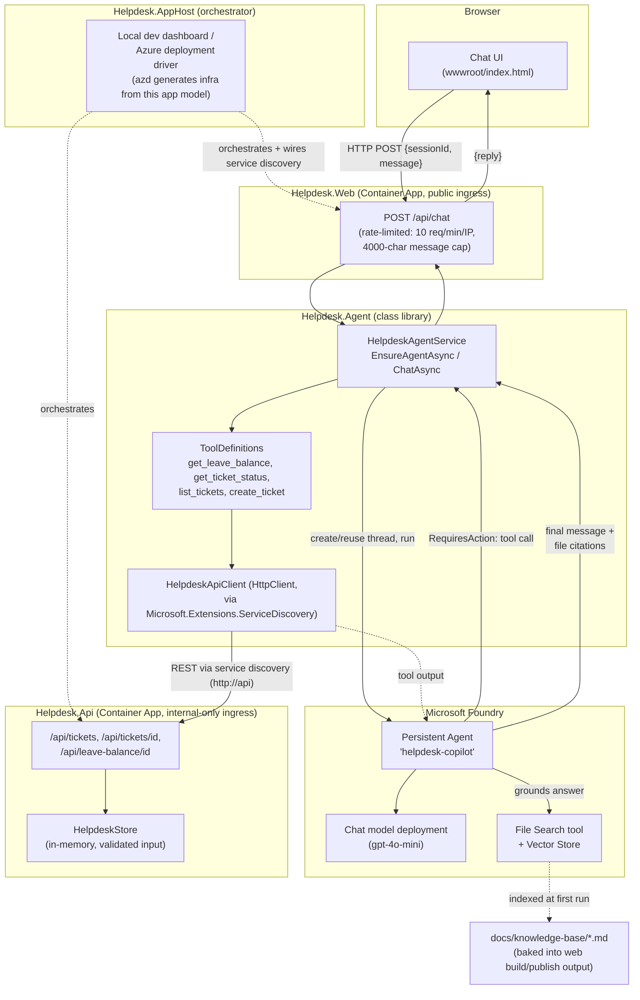
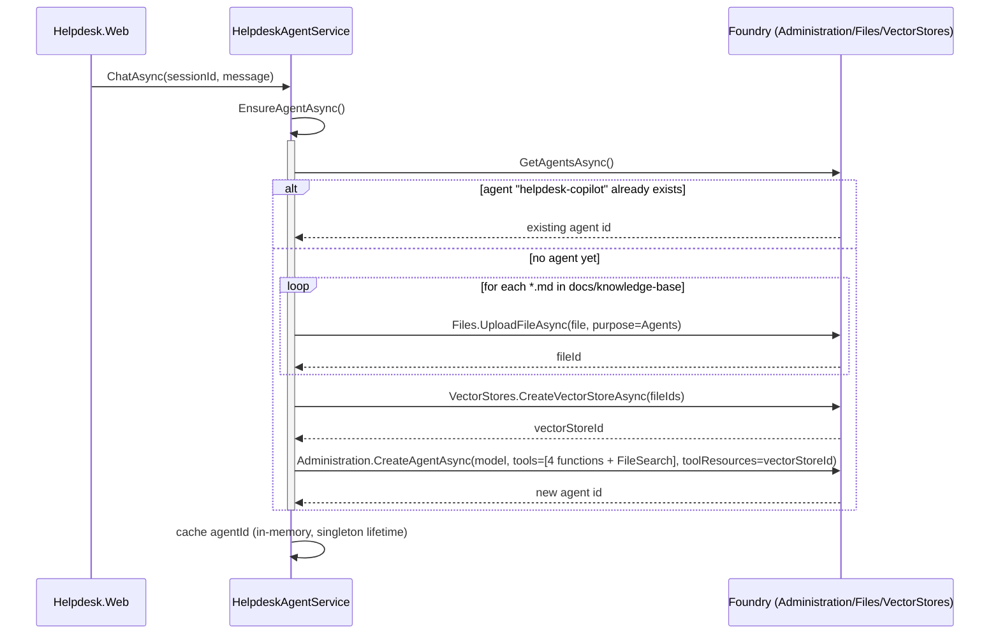
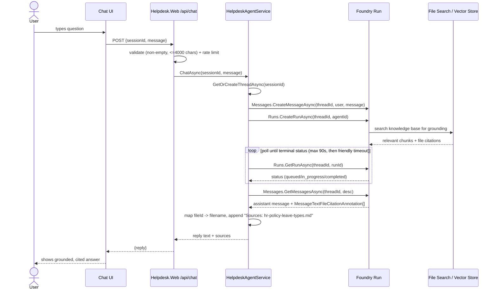
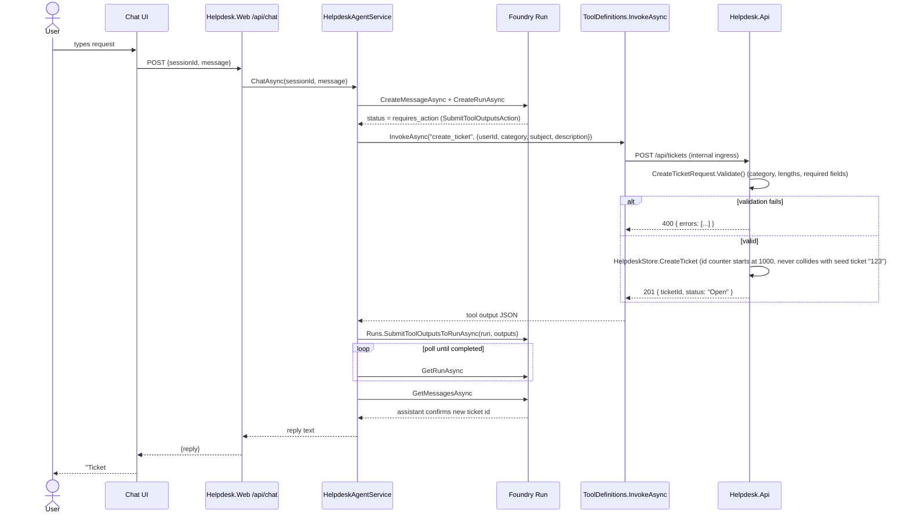

# Architecture, Flow & Sequence Diagrams

Companion to [PRD.md](../PRD.md) and [README.md](../README.md). These diagrams reflect the
actual implementation in `src/` as of this review, not just the PRD's aspirational design.

## 1. Component / Flow Diagram

**Security-relevant notes reflected above (see review in chat for full rationale):**
- `Helpdesk.Api` ingress is **internal-only** — it has no end-user auth, so it must not be reachable from the public internet; only `Helpdesk.Web` calls it, over the Container Apps environment's internal network. The base URL is resolved via Aspire service discovery (`http://api`, wired by `.WithReference(api)` in `Helpdesk.AppHost`) rather than a hardcoded address, so it works identically for local dev (dynamic port) and Azure (internal Container Apps DNS).
- `Helpdesk.Web` → Foundry uses a **dedicated user-assigned managed identity** (`builder.AddAzureUserAssignedIdentity(...)` in `Helpdesk.AppHost`, attached via `.WithAzureUserAssignedIdentity(...)`), authenticated with `DefaultAzureCredential` — no API keys. `disableLocalAuth: true` on the Cognitive Services account (`infra/foundry.bicep`) enforces this.
- `/api/chat` is rate-limited and input-length-capped to bound cost/abuse exposure given there's no per-user authentication (PRD non-goal).
- `Helpdesk.ServiceDefaults` (referenced by both `Helpdesk.Api` and `Helpdesk.Web`) wires OpenTelemetry (traces/metrics/logs), `/health` + `/alive` health checks, and service discovery/resilience HTTP handlers consistently across both services.

## 2. Sequence Diagram — Agent Bootstrap (first request after cold start)

## 3. Sequence Diagram — Grounded Policy Question (File Search + citations)

*User: "How many vacation days do I get?"*

## 4. Sequence Diagram — Action via Function Tool (create a ticket)

*User: "Reset my laptop password, please open a ticket for alice."*

